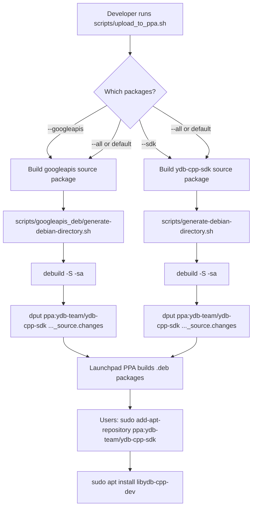
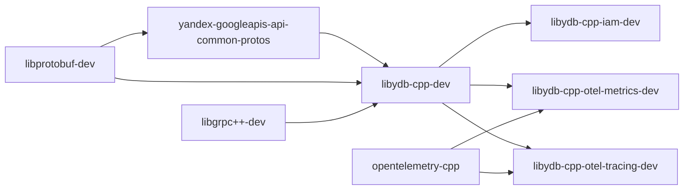

# Plan: PPA Upload Script & Launchpad PPA Setup

## Overview

This plan covers two deliverables:
1. A script (`scripts/upload_to_ppa.sh`) that builds Debian **source packages** and uploads them to a Launchpad PPA.
2. Complete instructions for creating and configuring the PPA on Launchpad.

The PPA will host **two source packages**:
- `yandex-googleapis-api-common-protos` — compiled Google API common proto specs (static libs, `.pb.h`, `.pb.cc`, Python stubs)
- `ydb-cpp-sdk` — the SDK itself (4 binary packages: `libydb-cpp-dev`, `libydb-cpp-iam-dev`, `libydb-cpp-otel-metrics-dev`, `libydb-cpp-otel-tracing-dev`)

## Architecture



## Key Concepts: How Launchpad PPAs Work

1. **PPAs only accept source packages** — Launchpad builds the `.deb` binaries on its own build farm.
2. Source packages consist of: `<pkg>_<ver>.orig.tar.gz`, `<pkg>_<ver>.debian.tar.xz`, `<pkg>_<ver>.dsc`, `<pkg>_<ver>_source.changes`.
3. The `.changes` file must be **GPG-signed** with a key registered on Launchpad.
4. Upload is done via `dput` to `ppa:OWNER/PPA_NAME`.
5. Each source package needs a proper `debian/` directory with `changelog`, `control`, `rules`, `source/format`, and optionally `.install` files.

## Detailed Steps

### 1. Create `scripts/googleapis_deb/generate-debian-directory.sh`

This script generates `debian/` metadata for the `yandex-googleapis-api-common-protos` source package. It must:

- Extract version from `scripts/googleapis_deb/CMakeLists.txt` (currently `1.0.0`)
- Generate `debian/changelog` with proper format for the target Ubuntu series (e.g., `noble`)
- Generate `debian/control` with:
  - `Source: yandex-googleapis-api-common-protos`
  - `Build-Depends: debhelper-compat (= 13), cmake, protobuf-compiler, libprotobuf-dev`
  - Binary package: `yandex-googleapis-api-common-protos`
  - `Depends: libprotobuf-dev`
- Generate `debian/rules` using cmake buildsystem with `CMAKE_INSTALL_PREFIX=/usr/share/yandex`
- Generate `debian/source/format` as `3.0 (quilt)`
- Generate `.install` file mapping built artifacts

**Key detail**: The CMakeLists.txt at `scripts/googleapis_deb/CMakeLists.txt` references `../../third_party/api-common-protos` — for the source package, the proto files must be included in the orig tarball. The script must handle this by creating a proper source tree.

### 2. Update `scripts/generate-debian-directory.sh`

The existing script already generates proper `debian/` metadata for the SDK. Minor updates needed:

- Add `--series` parameter to target specific Ubuntu release (default: `noble` for 24.04)
- Ensure the changelog entry targets the correct series name instead of `unstable`
- Add `yandex-googleapis-api-common-protos` as a Build-Depends and runtime Depends for `libydb-cpp-dev`

### 3. Create `scripts/upload_to_ppa.sh`

Main upload script with the following interface:

```bash
./scripts/upload_to_ppa.sh [OPTIONS]

Options:
  --ppa PPA_NAME        PPA identifier (default: ppa:ydb-team/ydb-cpp-sdk)
  --series SERIES       Ubuntu series (default: noble)
  --googleapis          Build and upload only googleapis package
  --sdk                 Build and upload only SDK packages
  --all                 Build and upload all packages (default)
  --gpg-key KEY_ID      GPG key ID for signing
  --dry-run             Build source packages but do not upload
  --skip-orig           Skip creating .orig.tar.gz (use -sd instead of -sa)
```

The script will:

1. **Validate prerequisites**: check for `debuild`, `dput`, `gpg`, `git`
2. **For googleapis package**:
   - Create a temporary build directory
   - Copy `scripts/googleapis_deb/` and `third_party/api-common-protos/` into it
   - Run `scripts/googleapis_deb/generate-debian-directory.sh`
   - Create `.orig.tar.gz` from the source tree
   - Run `debuild -S -sa` (or `-sd` if `--skip-orig`)
   - Run `dput $PPA ..._source.changes`
3. **For SDK package**:
   - Run `scripts/generate-debian-directory.sh --series $SERIES`
   - Create `.orig.tar.gz` from the git archive (excluding `.git`, build dirs)
   - Run `debuild -S -sa`
   - Run `dput $PPA ..._source.changes`

### 4. Create `.github/workflows/ppa_publish.yaml`

GitHub Actions workflow for automated PPA publishing on release tags:

```yaml
on:
  release:
    types: [published]
  workflow_dispatch:
    inputs:
      series:
        description: Ubuntu series
        default: noble
      dry_run:
        description: Dry run
        type: boolean
        default: true
```

The workflow will:
- Import GPG private key from GitHub secret `GPG_PRIVATE_KEY`
- Configure `dput` with PPA settings
- Run `scripts/upload_to_ppa.sh --all --series $SERIES --gpg-key $KEY_ID`
- Use `workflow_dispatch` for manual triggers with dry-run option

### 5. Update `README.md`

Add sections:
- **Using the PPA** — instructions for end users to add the PPA and install packages
- **Publishing to PPA** — instructions for maintainers on GPG setup and upload process

### 6. Create `plans/ppa-setup.md`

Comprehensive PPA setup documentation covering:
- Launchpad account creation
- GPG key generation and registration
- PPA creation on Launchpad
- GitHub secrets configuration
- Testing the upload flow

## File Changes Summary

| File | Action | Description |
|------|--------|-------------|
| `scripts/upload_to_ppa.sh` | **Create** | Main PPA upload script |
| `scripts/googleapis_deb/generate-debian-directory.sh` | **Create** | Debian metadata generator for googleapis package |
| `scripts/generate-debian-directory.sh` | **Modify** | Add --series param, fix changelog series |
| `.github/workflows/ppa_publish.yaml` | **Create** | CI workflow for automated PPA publishing |
| `README.md` | **Modify** | Add PPA usage and publishing instructions |
| `plans/ppa-setup.md` | **Create** | Detailed PPA setup documentation |

## PPA Creation Instructions (for `plans/ppa-setup.md`)

### Prerequisites

1. **Launchpad account** at https://launchpad.net
2. **GPG key** (RSA 4096-bit recommended)
3. **Ubuntu development tools**: `sudo apt install devscripts dput debhelper gpg`

### Step-by-step PPA Setup

#### 1. Generate GPG Key

```bash
gpg --full-generate-key
# Choose: RSA and RSA, 4096 bits, no expiration
# Name: YDB Team
# Email: <team-email>
```

#### 2. Upload GPG Key to Ubuntu Keyserver

```bash
gpg --keyserver keyserver.ubuntu.com --send-keys <KEY_ID>
```

#### 3. Register GPG Key on Launchpad

- Go to https://launchpad.net/~/+editpgpkeys
- Paste the GPG key fingerprint
- Confirm via email

#### 4. Create PPA on Launchpad

- Go to https://launchpad.net/~/+activate-ppa
- Name: `ydb-cpp-sdk`
- Display name: `YDB C++ SDK`
- Description: `YDB C++ SDK development packages and dependencies`
- Distribution: `Ubuntu`
- Architectures: `amd64`, `arm64` (optional)

#### 5. Configure `~/.dput.cf`

```ini
[ydb-cpp-sdk]
fqdn = ppa.launchpad.net
method = ftp
incoming = ~ydb-team/ubuntu/ydb-cpp-sdk/
login = anonymous
allow_unsigned_uploads = 0
```

Or use the shorthand: `dput ppa:ydb-team/ydb-cpp-sdk <changes_file>`

#### 6. Configure GitHub Secrets

For CI automation, add these secrets to the GitHub repository:

| Secret | Description |
|--------|-------------|
| `GPG_PRIVATE_KEY` | ASCII-armored GPG private key (`gpg --armor --export-secret-keys KEY_ID`) |
| `GPG_PASSPHRASE` | Passphrase for the GPG key |
| `LAUNCHPAD_PPA` | PPA identifier (e.g., `ppa:ydb-team/ydb-cpp-sdk`) |

#### 7. Test Upload

```bash
# Dry run (builds source packages without uploading)
./scripts/upload_to_ppa.sh --all --dry-run

# Actual upload
./scripts/upload_to_ppa.sh --all --gpg-key <KEY_ID>
```

#### 8. End-User Installation

Once packages are published:

```bash
sudo add-apt-repository ppa:ydb-team/ydb-cpp-sdk
sudo apt update
sudo apt install libydb-cpp-dev libydb-cpp-iam-dev
```

## Package Dependency Chain



## Important Notes

1. **PPA builds happen on Launchpad servers** — all Build-Depends must be available in the target Ubuntu release or in the same PPA.
2. **googleapis package must be uploaded first** — the SDK depends on it at build time.
3. **OpenTelemetry**: Ubuntu 24.04 does not ship `opentelemetry-cpp` packages. Options:
   - Build and upload an `opentelemetry-cpp` package to the same PPA
   - Disable OTel plugins in the PPA build (simpler, but loses functionality)
   - Use vendored/FetchContent approach in the PPA build
4. **Version bumping**: Each upload to the same series must have a unique version. Use `~ppa1`, `~ppa2` suffixes for rebuilds.
5. **The `CPACK_PACKAGING_INSTALL_PREFIX`** in `scripts/googleapis_deb/CMakeLists.txt` is set to `/usr/share/yandex` — this must match the `CMAKE_INSTALL_PREFIX` and `CMAKE_PREFIX_PATH` used by the SDK build.
